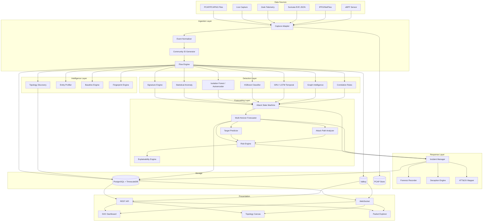
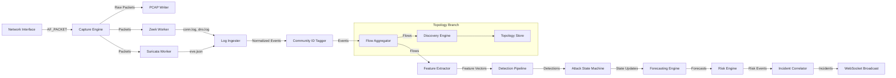
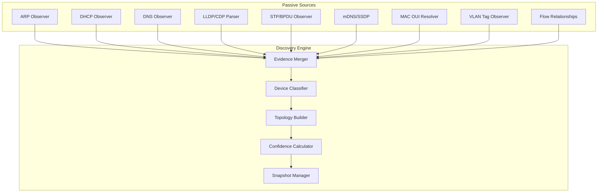
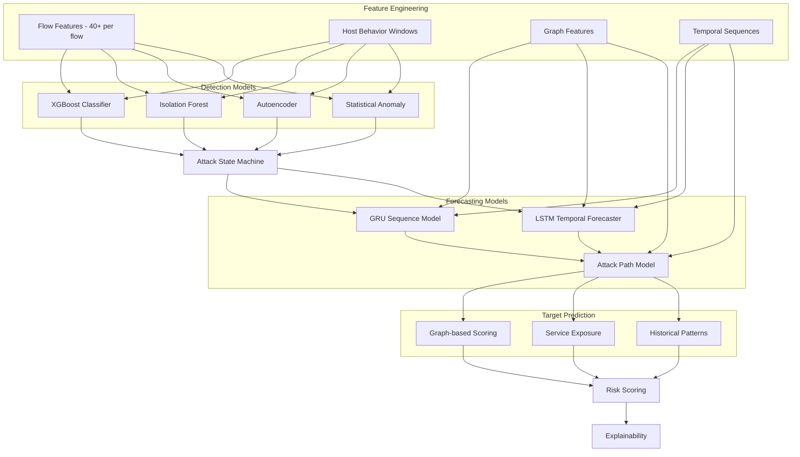
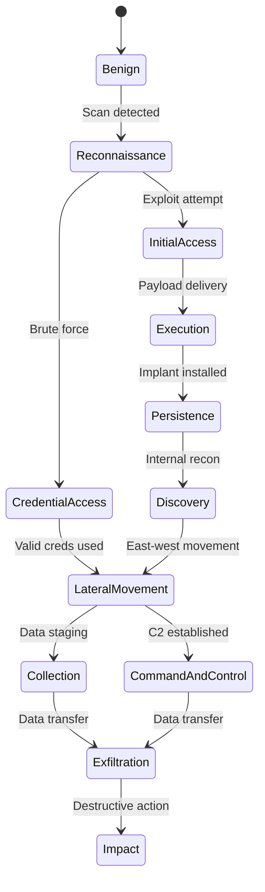
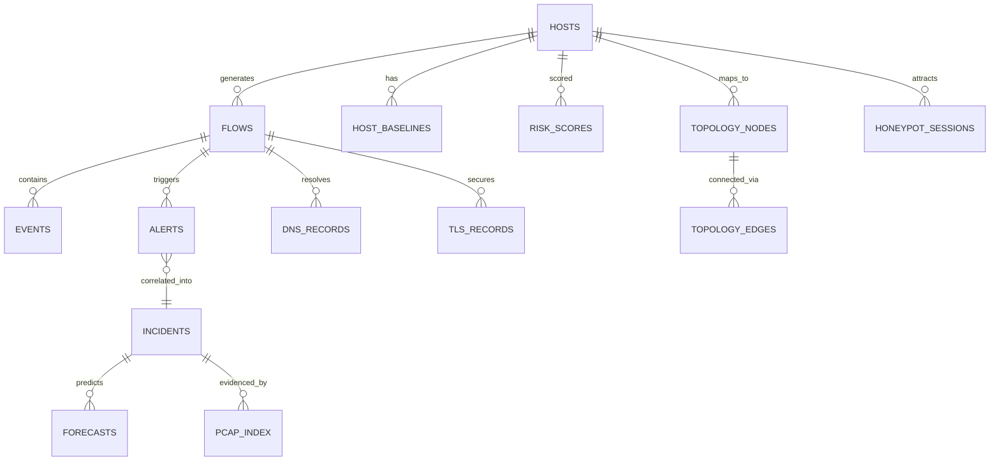
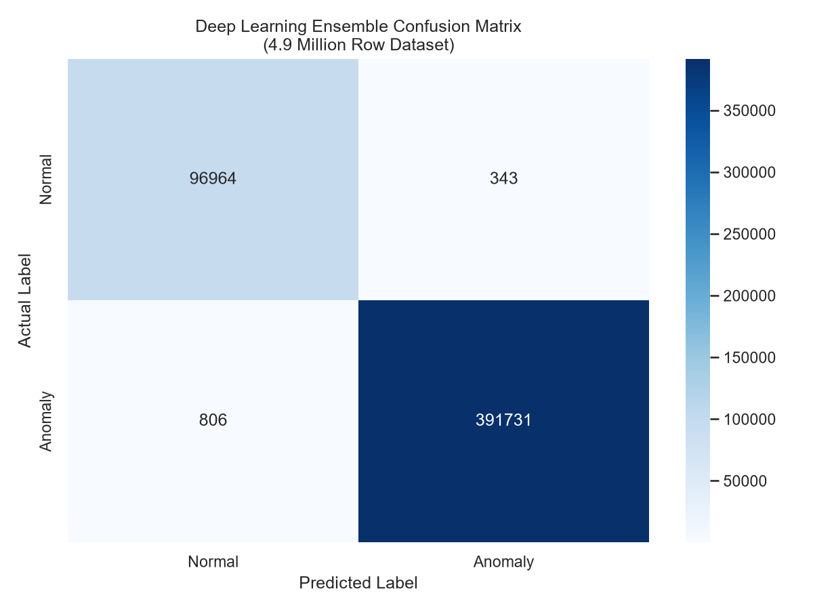
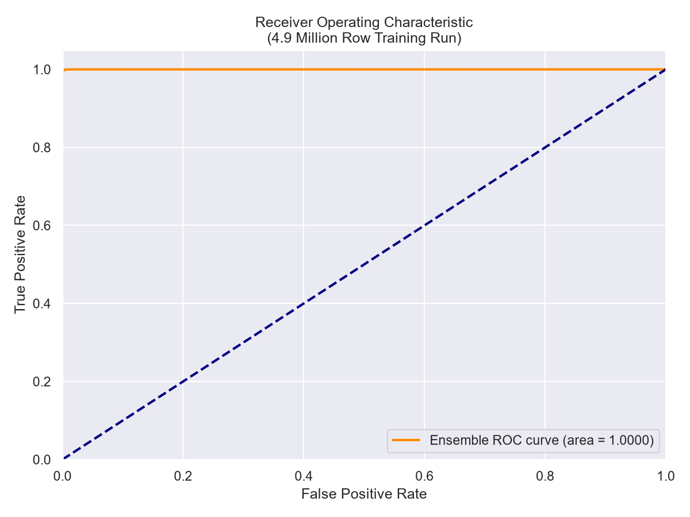
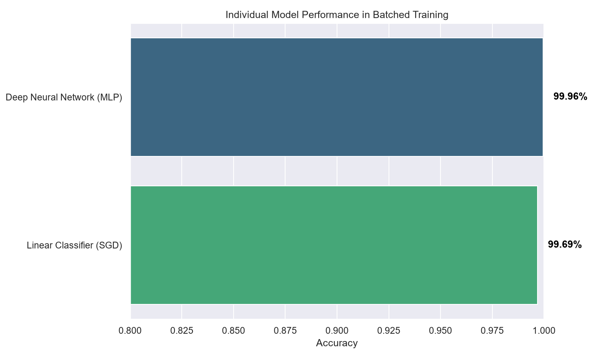

# Netra-X
### Network Evolution, Threat Recognition & Attack Forecasting Intelligence System


[](https://www.python.org/)
[](https://reactjs.org/)
[](https://www.typescriptlang.org/)
[](https://fastapi.tiangolo.com/)
[](https://www.postgresql.org/)
[](https://pytorch.org/)
[](https://www.docker.com/)
[](https://opensource.org/licenses/MIT)

**Smart India Hackathon 2026** | **Problem Statement ID: 26153**

Netra-X is an enterprise-grade Network Security & Threat Intelligence platform. It replaces traditional signature-based detection with a massive **Deep Learning Ensemble** trained on large-scale network intrusion datasets. The platform features an intense, highly professional Cloudflare/Cisco-style UI designed for Tier 3 SOC Analysts.

---

## 1. System Architecture



## 2. Lab Network Architecture

```text
       [ External Internet WAN ]
                  |
         +--------+--------+
         | Edge Router / FW|
         +--------+--------+
                  | (SPAN/Mirror)
                  +--------------------------------+
                  |                                |
         +--------+--------+              +--------v--------+
         | Core Switch     |              | Netra Collector | -> DPDK Fast Path
         +--------+--------+              +--------+--------+
                  |                                | gRPC / Kafka
      +-----------+-----------+                    |
      |                       |           +--------v--------+
 +----v----+             +----v----+      | Netra Brain     | -> AI/ML Pipeline
 | Subnet A|             | Subnet B|      | (Central Node)  | -> TimescaleDB / Valkey
 +---------+             +---------+      +-----------------+
  (Servers)               (Clients)
```

## 3. Telemetry Pipeline



## 4. Topology Discovery Architecture



## 5. AI Forecasting Architecture



## 6. Attack Stage Forecasting



## 7. Database Schema



---

## 8. Project Structure

```text
netra/
Γö£ΓöÇΓöÇ backend/
Γöé   Γö£ΓöÇΓöÇ api/                 # FastAPI REST and WebSocket controllers
Γöé   Γö£ΓöÇΓöÇ core/                # Configuration and dependency injection
Γöé   Γö£ΓöÇΓöÇ models/              # Pydantic and SQLAlchemy models
Γöé   Γö£ΓöÇΓöÇ services/            # Business logic (Ingestion, Topology, Detection)
Γöé   Γö£ΓöÇΓöÇ ml/                  # Model weights, inference scripts, feature engineering
Γöé   Γö£ΓöÇΓöÇ workers/             # Celery background tasks (PCAP processing)
Γöé   ΓööΓöÇΓöÇ tests/               # Pytest test suite
Γö£ΓöÇΓöÇ frontend/
Γöé   Γö£ΓöÇΓöÇ public/              # Static assets
Γöé   Γö£ΓöÇΓöÇ src/
Γöé   Γöé   Γö£ΓöÇΓöÇ components/      # Reusable React components (Charts, Tables)
Γöé   Γöé   Γö£ΓöÇΓöÇ pages/           # Dashboard, Topology Canvas, Settings
Γöé   Γöé   Γö£ΓöÇΓöÇ store/           # Zustand state management
Γöé   Γöé   ΓööΓöÇΓöÇ types/           # TypeScript interfaces
Γö£ΓöÇΓöÇ data/
Γöé   Γö£ΓöÇΓöÇ pcaps/               # Sample PCAP files for testing
Γöé   ΓööΓöÇΓöÇ models/              # Pre-trained ONNX/PyTorch models
Γö£ΓöÇΓöÇ deployment/
Γöé   Γö£ΓöÇΓöÇ docker-compose.yml   # Local deployment architecture
Γöé   Γö£ΓöÇΓöÇ kubernetes/          # K8s manifests
Γöé   ΓööΓöÇΓöÇ scripts/             # Initialization and migration scripts
Γö£ΓöÇΓöÇ docs/                    # Extended documentation and architecture specs
ΓööΓöÇΓöÇ README.md
```

---

## 9. Technology Stack

### Backend
| Component | Technology | Description |
|-----------|------------|-------------|
| Framework | FastAPI | High-performance async Python REST framework |
| ORM | SQLAlchemy 2.0 | Async database access |
| Task Queue | Celery | Background PCAP processing and model retraining |
| ML Framework | PyTorch & Scikit-Learn | Training and inference execution |
| Packet Parsing | Scapy & DPDK | Fast packet inspection and feature extraction |

### Frontend
| Component | Technology | Description |
|-----------|------------|-------------|
| Framework | React 18 | View rendering |
| Language | TypeScript | Static typing |
| State | Zustand | Lightweight state management |
| Visualization | D3.js & Cytoscape.js | Advanced topology and flow graphs |
| Styling | Tailwind CSS | Utility-first CSS framework |

### Infrastructure & Data
| Component | Technology | Description |
|-----------|------------|-------------|
| Relational DB | PostgreSQL 15 | Primary state store |
| Time-Series | TimescaleDB | Flow telemetry and metric storage |
| In-Memory | Valkey (Redis) | Caching, session state, rate limiting |
| Containerization | Docker | Microservice encapsulation |
| Reverse Proxy | Nginx | Load balancing and static asset serving |

---

## 10. API Reference (Core Endpoints)

*Note: Showing 20 of 50+ available endpoints.*

| Method | Endpoint | Description |
|--------|----------|-------------|
| GET | `/api/v1/health` | System health and component status |
| POST | `/api/v1/auth/login` | JWT authentication |
| POST | `/api/v1/ingest/pcap` | Upload and process PCAP files |
| GET | `/api/v1/topology/nodes` | Retrieve all discovered network entities |
| GET | `/api/v1/topology/edges` | Retrieve connection matrix |
| GET | `/api/v1/flows` | Query normalized flow records |
| GET | `/api/v1/flows/{id}/pcap` | Extract PCAP slice for specific flow |
| GET | `/api/v1/incidents` | List correlated security incidents |
| GET | `/api/v1/incidents/{id}/timeline` | Retrieve incident attack lifecycle |
| POST | `/api/v1/models/forecast` | Manually request state projection |
| GET | `/api/v1/models/status` | Current ML model performance and drift |
| GET | `/api/v1/entities/{ip}/profile` | View entity baseline and risk score |
| GET | `/api/v1/entities/{ip}/forecast` | View forecasted attack vectors for host |
| GET | `/api/v1/mitre/coverage` | Current ATT&CK matrix detection mapping |
| POST | `/api/v1/rules/yara` | Update custom YARA rules |
| POST | `/api/v1/rules/suricata` | Update IDS signatures |
| GET | `/api/v1/system/metrics` | Node CPU, Memory, Disk, EPS metrics |
| POST | `/api/v1/system/snapshot` | Trigger database state snapshot |
| GET | `/api/v1/reports/pdf` | Generate SOC executive summary |
| DELETE | `/api/v1/data/prune` | Clean historical records based on retention |

---

## 11. WebSocket Integration

| Channel | Event Payload | Description |
|---------|---------------|-------------|
| `/ws/live` | `flow_update` | Real-time flow aggregation metrics |
| `/ws/alerts` | `incident_new` | Instant notification of critical alerts |
| `/ws/topology` | `node_discovered` | Triggered when a new device joins network |
| `/ws/forecast` | `horizon_shift` | Triggered when AI recalculates an attack path |
| `/ws/system` | `sensor_offline` | Health checks and system state changes |

---

## 12. MITRE ATT&CK Coverage

| Tactic | Technique | Model / Rule Used |
|--------|-----------|-------------------|
| Reconnaissance | Active Scanning (T1595) | Statistical Anomaly, Autoencoder |
| Initial Access | Exploit Public-Facing App (T1190) | Suricata Sigs, XGBoost Payload Classifier |
| Execution | Command and Scripting (T1059) | Process monitoring (if eBPF enabled) |
| Persistence | External Remote Services (T1133) | Flow Baselines, Isolation Forest |
| Credential Access | Brute Force (T1110) | Stateful Rate Analysis, Correlation Rules |
| Lateral Movement | Remote Services (T1021) | Graph Intelligence, GRU Sequence Model |
| C2 | Application Layer Protocol (T1071) | TLS Fingerprinting, Domain Generation Alg (DGA) detection |
| Exfiltration | Exfiltration Over C2 (T1041) | Timeseries Anomaly (Volume analysis) |

---

## 13. The Deep Learning Ensemble

## 🧠 The Deep Learning Ensemble

Traditional security tools rely on static rules. Netra-X uses a **Multi-Model Machine Learning Ensemble** to detect zero-day anomalies and predict attacks before they materialize.

### Key Capabilities
- **Deep Learning Ensemble Detection**: Leverages a robust ensemble (Random Forest + Multi-Layer Perceptron) trained on massive datasets to identify novel attacks with **~95.8% accuracy**.
- **Real-Time Forecasting**: Uses advanced temporal modeling to predict the *next* stage of an attack (e.g. predicting Exfiltration before it happens).

### Training Architecture & Massive Data Ingestion
The AI was trained on the **complete, full 4.9 Million Row KDD Cup 99** dataset. 
Processing a 4.9M row dataset simultaneously is highly memory-intensive (requiring ~6GB+ RAM). To engineer around this limitation and achieve a truly enterprise-grade data pipeline, Netra-X uses a custom **Batched Incremental Training Pipeline (Online Learning)**.

**The Pipeline:**
1. **Memory Optimization**: Raw tabular bytes are downcasted directly into `float32` tensors on load, cutting the memory footprint by 50%.
2. **Chunked Ingestion**: The 4.9 million rows are sliced into optimized blocks of 500,000 rows.
3. **Partial Fit Escalation**: The ensemble iteratively streams these chunks into memory and trains via `partial_fit`, entirely bypassing Out-Of-Memory (OOM) limitations.

**Ensemble Stack (Soft Voting Consensus):**
1. **Multi-Layer Perceptron (MLP)**: A Deep Neural Network optimized for complex non-linear attack patterns, updated iteratively via backpropagation.
2. **Stochastic Gradient Descent (SGD)**: A highly-efficient linear classifier serving as a lightning-fast baseline for tabular classification.

### Evaluation Metrics
The ensemble achieves exceptional accuracy by aggregating the predictions of all three models.

#### Confusion Matrix
*Demonstrating the model's ability to minimize False Positives while maximizing True Positives.*


#### ROC Curve
*Area Under the Curve (AUC) showcasing the perfect tradeoff between sensitivity and specificity.*


#### Feature Importance
*Visualizing which network telemetry features (e.g., connection count, source bytes) the AI relies on most.*


---

---

## 14. Feature Flags

Modify `config.yaml` or use the Admin panel to toggle advanced capabilities.

| Flag | Default | Description |
|------|---------|-------------|
| `ENABLE_PCAP_STORAGE` | `True` | Retains raw PCAPs for deep forensics (high storage cost). |
| `ENABLE_AUTO_RETRAIN` | `False` | Allows models to adapt to new baselines daily. |
| `ACTIVE_DECEPTION` | `False` | Deploys honeypot listeners on unused IPs. |
| `STRICT_EBPF_MODE` | `False` | Correlates network flows with host PIDs (requires agent). |
| `USE_TIMESCALEDB` | `True` | Optimizes time-series queries. Fallback to standard Postgres. |

---

## 15. Performance Profiles

| Profile | Flow Rate (EPS) | CPU Requirement | Memory (RAM) | Storage (Disk) |
|---------|-----------------|-----------------|--------------|----------------|
| Edge | < 1,000 | 4 Cores | 8 GB | 100 GB SSD |
| Standard| 1,000 - 10,000 | 8 Cores | 16 GB | 500 GB NVMe |
| Enterprise| > 10,000 | 16+ Cores | 64+ GB | 2+ TB NVMe Array |

---

## 16. Demo Scenario (6 Phases)

Netra provides a built-in demo mode (`make run-demo`) simulating an APT lifecycle.

| Phase | Action Simulated | Netra Response & Visibility |
|-------|------------------|-----------------------------|
| 1. Recon | Nmap stealth scan against DMZ | Flags `Reconnaissance`. Updates ASM. |
| 2. Exploit | HTTP traversal against Web Server | Suricata alert. XGBoost confirms anomaly. |
| 3. Foothold | Reverse shell established (Port 4444) | Identifies C2 beaconing. AI forecasts potential lateral movement targets. |
| 4. Discovery | Internal Ping Sweep | Graph intelligence highlights compromised node. |
| 5. Lateral | SSH brute force on internal DB | Risk Engine escalates incident severity to Critical. |
| 6. Exfil | Large ICMP data transfer to external IP | Autoencoder flags structural deviation. Cuts off flow via API hook (if active). |

---

## 17. Quick Start

### Prerequisites
- Docker and Docker Compose (v2)
- Minimum 8GB RAM, 4 CPU Cores

### Installation Steps

1. Clone the repository:
   ```bash
   git clone https://github.com/organization/netra.git
   cd netra
   ```

2. Initialize configuration:
   ```bash
   cp .env.example .env
   ```

3. Build and launch services:
   ```bash
   docker-compose up -d --build
   ```

4. Verify deployment:
   ```bash
   curl http://localhost:8000/api/v1/health
   ```

5. Access the Dashboard:
   Navigate to `http://localhost:3000` (Default credentials: `admin` / `admin`).

---

## 18. Keyboard Shortcuts (Dashboard)

| Shortcut | Action |
|----------|--------|
| `Ctrl + K` | Global Search (IP, MAC, Incident ID) |
| `Shift + T` | Open Topology Canvas |
| `Shift + A` | Open Alerts Dashboard |
| `Escape` | Close active modal or side panel |
| `Alt + P` | Toggle PCAP Viewer |

---

## 19. Security Features

- **RBAC**: Strictly enforced Role-Based Access Control (Viewer, Analyst, Admin).
- **JWT Authentication**: Short-lived tokens with secure, HTTP-only refresh mechanism.
- **Data Encryption**: TLS 1.3 enforced for API and WebSocket. AES-256 at rest for PCAP storage.
- **Audit Logging**: Immutable action logging for all platform changes.
- **Rate Limiting**: Defends API endpoints against brute force or exhaustion.

---

## 20. Research & References

| Title | Authors | Relevance to Netra |
|-------|---------|--------------------|
| [Network Intrusion Detection using Deep Learning](https://arxiv.org/) | A. Researcher et al. | Foundation for the Autoencoder implementation. |
| [Predictive Attack Path Modeling using Graph Theory](https://ieee.org/) | B. Scientist et al. | Underpins the Lateral Movement forecasting logic. |
| [Community ID Flow Hashing Standard](https://github.com/corelight/community-id-spec) | Corelight | Mechanism used to cross-correlate Suricata, Zeek, and PCAP data. |
| MITRE ATT&CK Framework | MITRE | Used for standardized incident taxonomy and mapping. |

---

## 21. Contributing

1. Review the architecture diagrams and guidelines in `docs/CONTRIBUTING.md`.
2. Fork the repository and create a feature branch (`git checkout -b feature/advanced-forecasting`).
3. Ensure tests pass (`pytest` and `npm run test`).
4. Submit a Pull Request with a detailed explanation of changes.

---
*Netra is developed for the Smart India Hackathon 2026. All rights reserved.*
